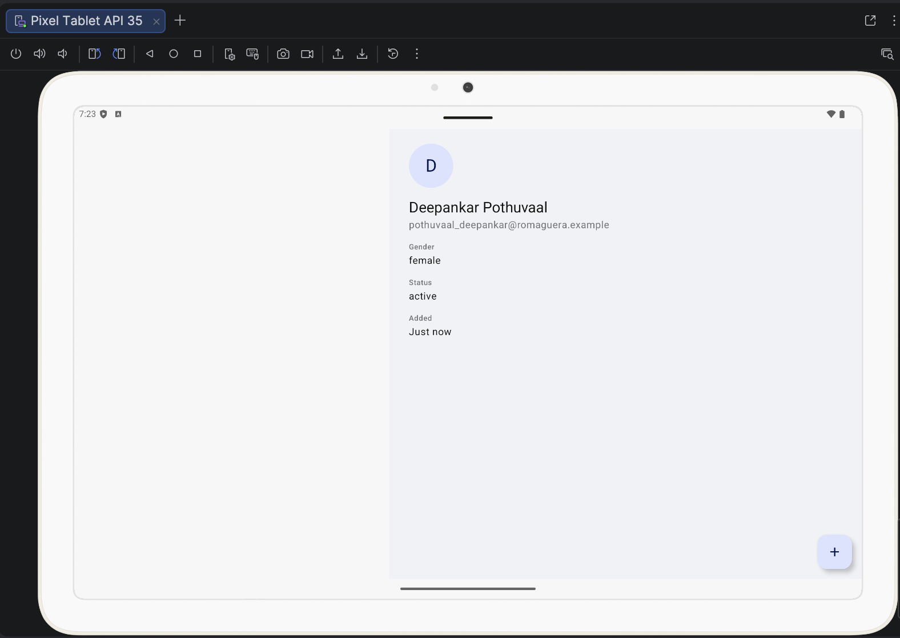
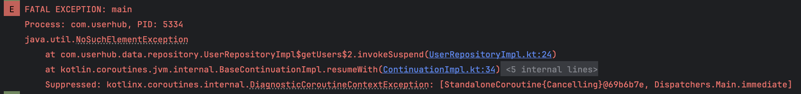
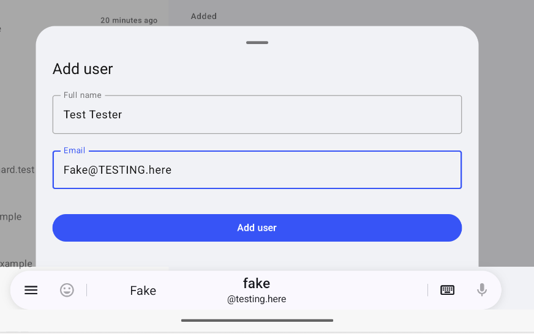
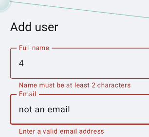
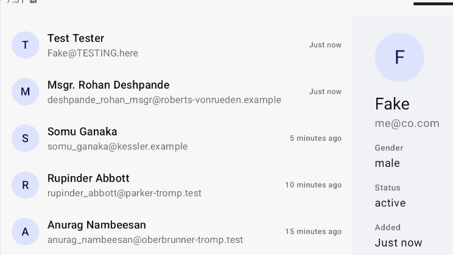

# Process Log

A running, append-only record of the process, findings, and decisions made while working on this tech task. Entries are chronological (oldest first). Entries are never edited or removed after the fact — corrections are added as new entries.

Each entry is attributed:
- **Note (dictated)** — the author's own words, lightly cleaned up for clarity, meaning unchanged.
- **Action (assistant)** — things done, found, or decided by the assistant while helping.

A final `## Summary` section will be added at the end, once ready for submission, synthesizing the log as a whole.

---

## 2026-09-20 — Action (assistant)

Set up this log. Rules agreed with the author:
1. Append-only; new entries go at the bottom in chronological order; no edits/deletions of past entries.
2. Dictated notes are recorded under their own headings, distinct from assistant actions.
3. The log gets its own commits (e.g. "Update process log"), kept separate from code/config commits.
4. A `## Summary` section is added last, once the author is ready to submit, synthesizing the full log.

Context: local repo was forked from `sliide/mobile-engineering-tech-task` to `daydreamapps/mobile-engineering-tech-task`. `origin` now points at the fork, `upstream` points at the original. Branch `chore/build-config` was created and commit `27b31b7` ("Add JVM toolchain and test setup") was made on it, covering changes to `build.gradle.kts` and `settings.gradle.kts`.

---

## 2026-09-20 — Note (dictated)

For clarity and an accurate record: I received this tech task on 16 September 2026. Before reading or running the code myself, I immediately set off an AI-assisted code review as an initial scan of the repository — this is entirely accurate and reflects the order in which things happened. That review is captured in this artifact, which I'm including here and will make publicly viewable: https://claude.ai/code/artifact/80e12594-bd45-4fe7-9c31-2e184fb4ea82

After that, I was away with no further involvement in this task — it was my birthday — until today, 20 September 2026. Today marks the actual start of my active working time on this task.

---

## 2026-09-20 — Note (dictated)

Process note: this stage is initial scoping — getting a feel for the app as a whole (it's a new project to me, though not large or complex) before moving on to review the most recent code changes specifically.

I ran the app on both an iOS simulator and an Android simulator. Both compiled and operated correctly at a basic level. I captured the full runtime logging output from both and asked for a review of it for issues.

## 2026-09-20 — Action (assistant)

Reviewed the full Android and iOS runtime logs provided. Findings:

- **Confirmed**: the bearer token is logged in plaintext on every network request, on both platforms (`Authorization: Bearer ...` visible in full in the log output), consistent with the verbose `Logging(LogLevel.ALL)` configuration already noted in this project's CLAUDE.md.
- **Needs verification**: on Android, immediately after a DELETE request completed successfully (204), the log shows `InputDispatcher: Channel is unrecoverably broken and will be disposed!` followed by the app process restarting entirely (old PID → new PID). No crash stack trace (`FATAL EXCEPTION`/`AndroidRuntime`) was present in the captured log to confirm this was a crash rather than a manual reinstall/relaunch from the IDE — flagged to check with a full unfiltered logcat if it recurs.
- No issue found with cache/backend consistency — record counts and deleted-user visibility across subsequent fetches were consistent with expected full-resync behaviour.
- Minor observation: user creation succeeded server-side with unusual input (mixed-case email, non-standard domains) with no apparent client-side rejection — worth checking against the AddUser screen's validation claims later, not treated as a confirmed bug yet.

---

## 2026-09-20 — Note (dictated)

Initial sweep of the code, starting with `AddUserViewModel` (`composeApp/src/commonMain/kotlin/com/userhub/presentation/AddUserViewModel.kt`).

Two things jump out:

1. **Weak error handling.** Only the success case from the HTTP call is checked — there's no handling of the different failure status codes that could come back, and no inspection of response content on failure either (though that would be a secondary concern).

2. **Both failure paths collapse to the same message.** Whether the response comes back as a non-200 status, or the request fails to go out at all, the result is reported to the user as "no internet connection" in both cases. This stood out because offline-first is one of the project's headline features — the README does note that offline-first only applies to the fetch path, but it's still strange that the error messaging/handling on the write side shows no offline-first thinking at all. It raises a broader question about how genuinely "offline-first" the project is, which I'll keep testing as I go through more of the code.

---

## 2026-09-20 — Note (dictated)

`AddUserViewModelTest` (`composeApp/src/commonTest/kotlin/com/userhub/presentation/AddUserViewModelTest.kt`) mostly looks okay. It's simple and only covers two cases — submission and success — both using a fake repository, which is an interesting implementation choice, but it seems fine, returning real HTTP response values via a Ktor mock library.

There's no failure case tested at all — the only check performed is that the error state is cleared, never that an error is actually surfaced correctly.

Additionally, a couple of minor compiler warnings here: use of `Duration` at the delay's timing point, and a missing opt-in for an annotation. This isn't the first opt-in annotation point I've seen across the project. Low importance given this is a test exercise, but this kind of thing would definitely matter in a larger production project.

---

## 2026-09-20 — Note (dictated)

`UserFeedViewModel` (`composeApp/src/commonMain/kotlin/com/userhub/presentation/UserFeedViewModel.kt`) — two points.

**1. Stale-data timestamp oddity (parked for now).** The "last updated" offline banner behaves correctly when I go offline — it shows null and doesn't display while the connection is up. But when I turn the connection off, it shows a timestamp from roughly an hour earlier than expected. Not sure yet if this is a BST/UTC handling issue, something else, or simply that a sync genuinely did happen in the previous hour. Given limited time, parking this rather than chasing it now — will circle back if it rises to the top of the priority list.

**2. Delete/undo is fundamentally broken, confirming the initial AI-assisted scan's finding.** `onDeleteConfirmed()` uses a hardcoded `GlobalScope` and fires the delete immediately — this doesn't feel right; I'd expect a custom dispatcher/scope owned by the ViewModel instead of reaching for `GlobalScope` directly. The `@DelicateCoroutinesApi` annotation is correctly present, acknowledging this is a deliberate but risky choice, but that doesn't make it the right call — some proper internal mechanism would be far more appropriate. This is wrong both for the offline-first ethos of the app and, more fundamentally, for the brief itself: a delete should only be submitted once confirmed (i.e. once the undo window has closed), not immediately with undo attempting to claw it back afterwards.

On top of the timing issue, undo itself is broken: it only re-adds the user back into the UI's rendering list, not into the repository/cache. Even if it did write back to the repository, that would introduce further problems — e.g. IDs being reissued on re-add, or the re-add being rejected for reasons like duplicate IDs, plus whatever other linking/relationships exist. The implementation is inherently broken as designed.

I confirmed this myself by testing: deleting a user, tapping undo, then restarting the app — the user does not come back. This directly confirms the finding from the initial AI-assisted scan that this flow is fundamentally broken and does not meet the brief's acceptance criteria.

---

## 2026-09-20 — Note (dictated)

`UserUiMapper` (`composeApp/src/commonMain/kotlin/com/userhub/presentation/UserUiMapper.kt`) explains the earlier "added timing" oddity I'd spotted: it automatically adds five minutes onto one of the items. Not sure if that's just an artifact of using a test account. In a more sophisticated implementation this would presumably have the real added-at value stored instead, but that clearly hasn't been the focus for this tech task — noting it in the log regardless.

This also partly explains the earlier "an hour off" timestamp observation, though not fully — I'm still not sure why that was off by an hour. Will dig further if needed. A quick look through `TimeProvider` (`domain/src/commonMain/kotlin/com/userhub/domain/time/TimeProvider.kt` and its Android/iOS `expect`/`actual` implementations) doesn't show any obvious core issue at first pass.

---

## 2026-09-20 — Note (dictated)

`AppTheme` (`composeApp/src/commonMain/kotlin/com/userhub/ui/AppTheme.kt`) — good idea, broken execution. Colors are given names, and those named colors are applied to values, but the naming/value consistency breaks down almost immediately. This should be fixed: consistent brand color names paired with consistent theme values matter a lot on a multiplatform project, since it's one of the easiest places for design and engineering to share exact language and save real time. Fixing this now, while it's small, should be straightforward as long as the new naming doesn't deviate from the actual internal design language.

Related: looking across the screens, there are inconsistent uses of constants for spacing/widths — some screens even hardcode values inline rather than using a shared constant. Same category of issue as the color naming: this is the kind of thing best resolved in collaboration with whoever owns the design language, but fixing it early while small would help a lot, especially for keeping design and engineering aligned.

Separately — noticed something new while looking at this: the detail panel isn't shown on narrow devices. Unclear whether the intent is for this to become a separate page on normal phones in future, or whether it's meant to stay tablet/wide-only as a split panel. Going to boot the app up on a tablet next to see it in action before drawing a conclusion.

---

## 2026-09-20 — Note (dictated)

A quick test on the tablet reveals another bug: when the currently-selected user in the master-detail view is deleted, the detail panel does not update — it keeps showing that user's content. It only switches away when a different user is clicked. When the last/final user is deleted, the detail panel still shows their details on the right-hand side, with no list left to select from.

Screenshot showing the stale detail panel (Pixel Tablet, after deleting down to the last user):



Also worth noting: deleting the final user allows the feed to resync correctly — it pulls the latest values from the API, same as a fresh launch. Against live test data this resync is obviously going to look inconsistent run to run, but the resync mechanism itself works fine in this case.

One thing I was specifically watching for: the initial AI-assisted scan flagged a risk that an empty cache combined with a fetch failure could crash the app. I was not able to reproduce that here. Not sure if that's because the underlying risk isn't actually there in practice, or just that I haven't hit the right conditions — noting it either way since it was something I was deliberately keeping an eye out for.

---

## 2026-09-20 — Note (dictated)

I've now managed to replicate the empty-cache crash flagged by the initial AI-assisted scan, which I couldn't reproduce earlier by reading the code alone. To trigger it: cleared the app's storage, then relaunched with Wi-Fi disabled.

The app hard crashes on launch:

```
AndroidRuntime  E  FATAL EXCEPTION: main
                    Process: com.userhub, PID: 5334
                    java.util.NoSuchElementException
                        at com.userhub.data.repository.UserRepositoryImpl$getUsers$2.invokeSuspend(UserRepositoryImpl.kt:24)
                        at kotlin.coroutines.jvm.internal.BaseContinuationImpl.resumeWith(ContinuationImpl.kt:34)
                        ...
                        Suppressed: kotlinx.coroutines.internal.DiagnosticCoroutineContextException: [StandaloneCoroutine{Cancelling}@69b6b7e, Dispatchers.Main.immediate]
```

Preceded in the log by:
```
System.out  I  HTTP: REQUEST https://gorest.co.in/public/v2/users failed with exception: java.net.UnknownHostException: Unable to resolve host "gorest.co.in": No address associated with hostname
```



This is probably the largest issue found so far, since it could give a negative first impression end-to-end immediately. It's also directly relevant to the acceptance criteria around the user being told what's wrong — I noted earlier that the error messages elsewhere are incomplete and not particularly offline-first-minded, but here the app doesn't tell the user anything at all, because it hard crashes outright. This goes to the top of the list of candidates to fix ourselves, though that list is going to stay a short one.

---

## 2026-09-20 — Note (dictated)

Screenshots from testing the add-user flow. Most of it seems fine — validation is very basic, but this is a proof-of-concept, so that's acceptable at this stage:




What is interesting: when a new user is added to the list, it correctly shows "Just now" — but that's not consistent with the staggered "X minutes ago" values shown for the other rows around it (5 minutes ago, 10 minutes ago, 15 minutes ago, etc., all in neat 5-minute steps rather than reflecting real elapsed time):



This highlights that we're missing part of the acceptance criteria. The AC states: *"Each row shows the user's name, email address, and how long ago they were added, expressed relatively ('5 minutes ago')."* What's actually implemented has been simplified down to just a flat five-minute stagger between each row, rather than the real underlying "added at" value the AC calls for.

This is probably our #2 priority to address. The delete functionality is interesting in its own right, but the read functionality — showing accurate data on the main feed — matters more.

---

## 2026-09-20 — Note (dictated)

Rounding out the undo/delete point already raised: we've established this doesn't work as specified — it deletes immediately rather than undoing anything. What's needed is some kind of callback for when the "undo window has elapsed" (the AC's exact language), and given the AC asks for this to use a snackbar, there's presumably meant to be some form of on-dismiss callback from the snackbar, or a persistent timer of some kind, driving that. This is another key item to address, though the exact implementation approach (how, specifically, the "elapsed" signal is derived) is more of an open, minor detail that could vary — the core requirement is what matters.

That gives us three core items needed to make this functional and AC-compliant: the empty-cache/offline crash, the missing relative "added ago" time on feed rows, and the undo/delete timing.

Next step: going to talk through the aspects of the overall project that feel out of sync more broadly, then work with Claude to investigate and decide on the actual changes to make.

---

## 2026-09-20 — Note (dictated)

Splitting into three parallel Claude sessions from this point: this session continues on the architecture/structure track (MVI vs MVVM, package layout — see the "Structure & State Review" artifact). A second session is focused on the core functional changes under consideration (the empty-cache crash, the missing relative "added ago" time, and the undo/delete timing). A third, smaller session is researching best practices around the `GlobalScope` concern flagged earlier in this log.

All three sessions will write to this same `PROCESS_LOG.md` on `chore/build-config`. Each will post its own entries as it completes points of work, and I'll pull the sessions back together here once all three tracks are done, with a closing entry marking when the split ends and covering final steps before submission.

---

## 2026-09-20 — Action (assistant)

Architecture track wrap-up. Investigated the MVVM/MVI inconsistency and package structure flagged earlier, with web research into current Kotlin Multiplatform / Compose Multiplatform structuring practice.

Findings:
- `UserFeedUiState` (sealed interface, MVI-style) and `AddUserState` (flat data class + success callback, MVVM-style) model state in two different philosophies within the same `presentation` package.
- The root cause of the stale-detail-panel bug (and, as flagged separately, the lost-selection-on-rotation bug) is the same: `DirectoryScreen` holds `selectedUser`, `pendingDelete`, and `showAddSheet` as local `remember {}` state rather than in either ViewModel's observable state, so nothing re-derives or persists it.
- `AddUserViewModel.submit()`'s success callback carries a raw `UserDto` through `DirectoryScreen` into `UserFeedViewModel.onUserCreated()`, crossing the UI boundary this project's own CLAUDE.md says should only ever see `UserUiModel`.
- `presentation/` and `ui/` are both flat, single-folder packages, inconsistent with `domain/` and `data/`, which are both already organized by concern (`domain/time/`, `domain/usecase/`; `data/local/`, `data/remote/`, `data/repository/`). Current 2026 guidance for KMP/Compose Multiplatform favors feature-based package grouping with layer separation inside each feature.

Produced an artifact laying this out visually — diagrams of the state-ownership split and the DTO-leak flow, the current flat package tree, and two consistent restructuring options (lean into MVI vs lean into MVVM) each showing its own package shape and how it resolves all four bugs found (stale panel, DTO leak, undo/delete timing, lost selection on rotation), plus a quick-reference table and a closing set of questions for discussion rather than a prescribed answer:

https://claude.ai/code/artifact/b6928d06-4f41-4754-81e2-1dec0f75d7cb

---

## 2026-09-20 — Action (assistant)

Functional-changes track wrap-up (the second of the three parallel sessions described above). Scope was the three items named at the end of the pre-split entry: the empty-cache/offline crash, the missing relative "added ago" time, and the undo/delete timing.

No production code has been changed on this branch yet — this session's output is a concrete, test-first implementation plan for all three, precise enough to hand to a fresh session per item and build without further discovery work. Traced each to its exact root cause in the current code:

- **Empty-cache crash** — `UserRepositoryImpl.getUsers()` calls `cached.maxOf { it.cachedAt }` unconditionally before checking `cached.isEmpty()`, so an offline launch with no cache throws `NoSuchElementException` instead of returning `UsersResult.NoInternet`. Smallest of the three; a few line reorder.
- **Fabricated "added ago" time** — `UserUiMapper` stamps each row with `now - index * 5min` rather than any real value, because the SQLDelight cache has nowhere to preserve a per-user first-seen time (every sync clears the table and reinserts everything stamped with the current sync time). While tracing this, also found a second, previously-parked bug that would silently undermine the fix: `TimeProvider.nowEpochMillis()` adds the local UTC offset on top of true epoch millis, while the cache's timestamps don't — so relative times come out inflated by exactly one hour on any non-UTC device (this is the "timestamp ~an hour off" oddity noted earlier in this log). Both need fixing together.
- **Undo/delete timing** — confirmed again independently: `onDeleteConfirmed()` fires the network delete immediately via `GlobalScope`, before the undo snackbar even appears, and `onUndo()` only ever patched in-memory UI state. Fix doesn't make undo smarter — it defers the actual delete until `DirectoryScreen`'s existing `SnackbarHostState.showSnackbar()` call returns anything other than "action performed," which is already the exact "undo window elapsed" signal the AC calls for; it just isn't wired to anything yet.

Each of the three is written up with the current buggy code, the failing test to add first, the passing implementation, and manual verification steps, plus an explicit note on where the three overlap in the file tree if run as separate sessions (items 1 and 2 both touch `UserRepositoryImpl`'s catch block; item 3 is independent). Full detail is in `IMPLEMENTATION_PLAN.md`, added to this branch; a formatted version for easier review is here:

https://claude.ai/code/artifact/4dca5664-58c9-4ade-b29e-5aeaaca8b45e
